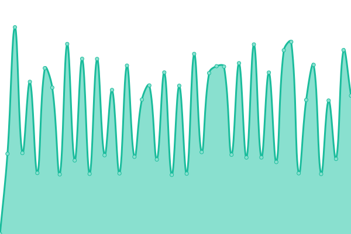
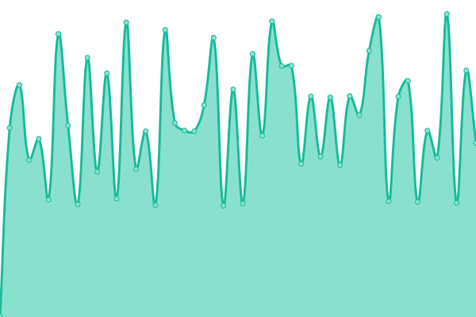
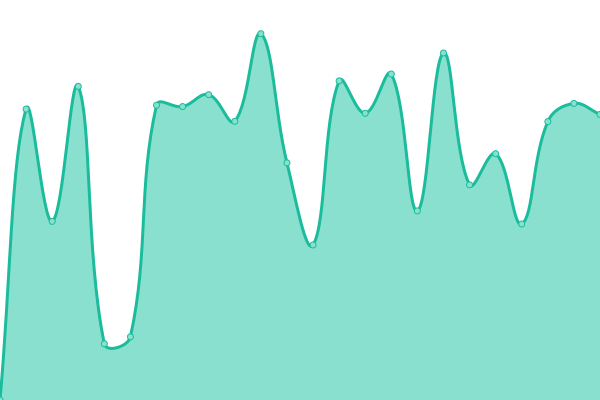
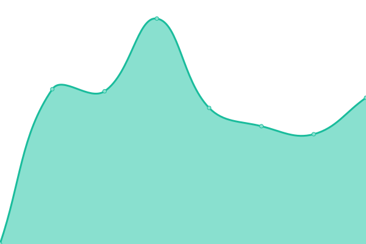
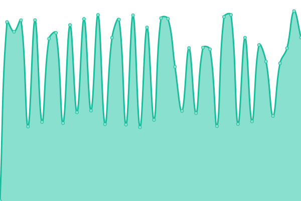
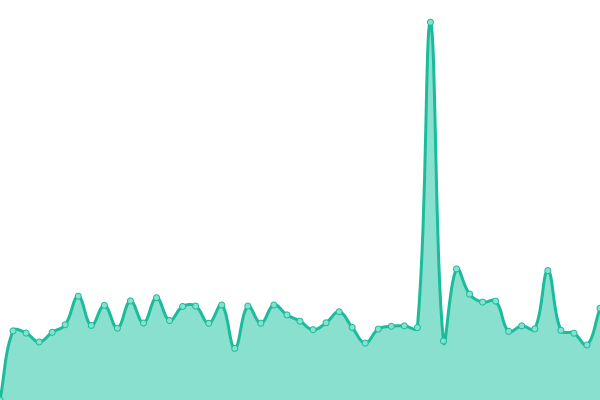
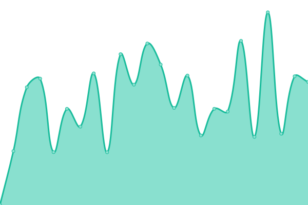
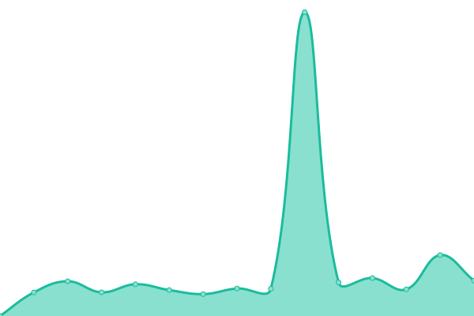

# [📈 Live Status](https://Clicki-Digital.github.io/uptime): <!--live status--> **🟩 All systems operational**

This repository contains the open-source uptime monitor and status page for [Clicki Digital](clickidigital.com.au), powered by [Upptime](https://github.com/upptime/upptime).

With [Upptime](https://upptime.js.org), you can get your own unlimited and free uptime monitor and status page, powered entirely by a GitHub repository. We use [Issues](https://github.com/Clicki-Digital/uptime/issues) as incident reports, [Actions](https://github.com/Clicki-Digital/uptime/actions) as uptime monitors, and [Pages](https://Clicki-Digital.github.io/uptime) for the status page.

<!--start: status pages-->
<!-- This summary is generated by Upptime (https://github.com/upptime/upptime) -->
<!-- Do not edit this manually, your changes will be overwritten -->
<!-- prettier-ignore -->
| URL | Status | History | Response Time | Uptime |
| --- | ------ | ------- | ------------- | ------ |
|  [Adam Brand Music](https://adambrandmusic.com) | 🟩 Up | [adam-brand-music.yml](https://github.com/Clicki-Digital/uptime/commits/HEAD/history/adam-brand-music.yml) | 

 825ms
     
 | 

<a href="https://status.clicki.digital/history/adam-brand-music">94.37%</a>
    

|  [All Access Electrical](https://allaccesselectrical.com.au) | 🟩 Up | [all-access-electrical.yml](https://github.com/Clicki-Digital/uptime/commits/HEAD/history/all-access-electrical.yml) | 

 1268ms
     
 | 

<a href="https://status.clicki.digital/history/all-access-electrical">94.37%</a>
    

|  [Ausource International](https://ausourceintl.com.au) | 🟩 Up | [ausource-international.yml](https://github.com/Clicki-Digital/uptime/commits/HEAD/history/ausource-international.yml) | 

 1322ms
     
 | 

<a href="https://status.clicki.digital/history/ausource-international">94.37%</a>
    

|  [Australian Anti Ice Campaign](https://australianantiicecampaign.org.au) | 🟩 Up | [australian-anti-ice-campaign.yml](https://github.com/Clicki-Digital/uptime/commits/HEAD/history/australian-anti-ice-campaign.yml) | 

 2072ms
     
 | 

<a href="https://status.clicki.digital/history/australian-anti-ice-campaign">100.00%</a>
    

|  [Beulah Revival Network](https://beulah.net.au) | 🟩 Up | [beulah-revival-network.yml](https://github.com/Clicki-Digital/uptime/commits/HEAD/history/beulah-revival-network.yml) | 

 1058ms
     
 | 

<a href="https://status.clicki.digital/history/beulah-revival-network">94.38%</a>
    

|  [Bookkeeper to the Smart People](https://bksp.com.au) | 🟩 Up | [bookkeeper-to-the-smart-people.yml](https://github.com/Clicki-Digital/uptime/commits/HEAD/history/bookkeeper-to-the-smart-people.yml) | 

 1563ms
     
 | 

<a href="https://status.clicki.digital/history/bookkeeper-to-the-smart-people">94.38%</a>
    

|  [Burdi](https://burdi.com.au) | 🟩 Up | [burdi.yml](https://github.com/Clicki-Digital/uptime/commits/HEAD/history/burdi.yml) | 

 2804ms
     
 | 

<a href="https://status.clicki.digital/history/burdi">94.15%</a>
    

|  [Burdi - Selfservice](https://manage.burdi.com.au) | 🟩 Up | [burdi-selfservice.yml](https://github.com/Clicki-Digital/uptime/commits/HEAD/history/burdi-selfservice.yml) | 

 2842ms
     
 | 

<a href="https://status.clicki.digital/history/burdi-selfservice">100.00%</a>
    

|  [Cafe7](https://cafe7.com.au) | 🟩 Up | [cafe7.yml](https://github.com/Clicki-Digital/uptime/commits/HEAD/history/cafe7.yml) | 

 1024ms
     
 | 

<a href="https://status.clicki.digital/history/cafe7">94.36%</a>
    

|  [CC Electrical and Air](https://ccelectricalandair.com.au) | 🟩 Up | [cc-electrical-and-air.yml](https://github.com/Clicki-Digital/uptime/commits/HEAD/history/cc-electrical-and-air.yml) | 

 864ms
     
 | 

<a href="https://status.clicki.digital/history/cc-electrical-and-air">94.36%</a>
    

|  [Chariots of Light Australia](https://chariotsoflight.org.au) | 🟩 Up | [chariots-of-light-australia.yml](https://github.com/Clicki-Digital/uptime/commits/HEAD/history/chariots-of-light-australia.yml) | 

 1118ms
     
 | 

<a href="https://status.clicki.digital/history/chariots-of-light-australia">94.36%</a>
    

|  [ClaimsWrights](https://claimswrights.co.uk) | 🟩 Up | [claims-wrights.yml](https://github.com/Clicki-Digital/uptime/commits/HEAD/history/claims-wrights.yml) | 

 1061ms
     
 | 

<a href="https://status.clicki.digital/history/claims-wrights">94.36%</a>
    

|  [Clear Cut Seafood Training](https://clearcutseafoodtraining.com/) | 🟩 Up | [clear-cut-seafood-training.yml](https://github.com/Clicki-Digital/uptime/commits/HEAD/history/clear-cut-seafood-training.yml) | 

 1357ms
     
 | 

<a href="https://status.clicki.digital/history/clear-cut-seafood-training">94.36%</a>
    

|  [Clicki Digital](https://clickidigital.com.au) | 🟩 Up | [clicki-digital.yml](https://github.com/Clicki-Digital/uptime/commits/HEAD/history/clicki-digital.yml) | 

 874ms
     
 | 

<a href="https://status.clicki.digital/history/clicki-digital">94.36%</a>
    

|  [Contreat](https://contreat.com.au) | 🟩 Up | [contreat.yml](https://github.com/Clicki-Digital/uptime/commits/HEAD/history/contreat.yml) | 

 936ms
     
 | 

<a href="https://status.clicki.digital/history/contreat">94.36%</a>
    

|  [Col Stringer](https://colstringer.com) | 🟩 Up | [col-stringer.yml](https://github.com/Clicki-Digital/uptime/commits/HEAD/history/col-stringer.yml) | 

 1419ms
     
 | 

<a href="https://status.clicki.digital/history/col-stringer">94.35%</a>
    

|  [Construction Training Institute](https://cti.edu.au/) | 🟩 Up | [construction-training-institute.yml](https://github.com/Clicki-Digital/uptime/commits/HEAD/history/construction-training-institute.yml) | 

 8995ms
     
 | 

<a href="https://status.clicki.digital/history/construction-training-institute">100.00%</a>
    

|  [Diverse AirCon & Mechanical](https://diverseaircon.com.au) | 🟩 Up | [diverse-air-con-and-mechanical.yml](https://github.com/Clicki-Digital/uptime/commits/HEAD/history/diverse-air-con-and-mechanical.yml) | 

 1563ms
     
 | 

<a href="https://status.clicki.digital/history/diverse-air-con-and-mechanical">94.35%</a>
    

|  [EntVenture](https://entventure.org) | 🟩 Up | [ent-venture.yml](https://github.com/Clicki-Digital/uptime/commits/HEAD/history/ent-venture.yml) | 

 892ms
     
 | 

<a href="https://status.clicki.digital/history/ent-venture">94.35%</a>
    

|  [Envirometal / We Buuy Scrap](https://webuyscrap.com.au/) | 🟩 Up | [envirometal-we-buuy-scrap.yml](https://github.com/Clicki-Digital/uptime/commits/HEAD/history/envirometal-we-buuy-scrap.yml) | 

 807ms
     
 | 

<a href="https://status.clicki.digital/history/envirometal-we-buuy-scrap">94.35%</a>
    

|  [First Harvest Coffee](https://firstharvestcoffee.com.au/) | 🟩 Up | [first-harvest-coffee.yml](https://github.com/Clicki-Digital/uptime/commits/HEAD/history/first-harvest-coffee.yml) | 

 767ms
     
 | 

<a href="https://status.clicki.digital/history/first-harvest-coffee">94.35%</a>
    

|  [Gary Rucci](https://garyrucci.com/) | 🟩 Up | [gary-rucci.yml](https://github.com/Clicki-Digital/uptime/commits/HEAD/history/gary-rucci.yml) | 

 1053ms
     
 | 

<a href="https://status.clicki.digital/history/gary-rucci">94.34%</a>
    

|  [Gracious5](https://gracious5.com) | 🟩 Up | [gracious5.yml](https://github.com/Clicki-Digital/uptime/commits/HEAD/history/gracious5.yml) | 

 836ms
     
 | 

<a href="https://status.clicki.digital/history/gracious5">94.34%</a>
    

|  [Gold Coast Edge Protection](https://gcep.net.au) | 🟩 Up | [gold-coast-edge-protection.yml](https://github.com/Clicki-Digital/uptime/commits/HEAD/history/gold-coast-edge-protection.yml) | 

 944ms
     
 | 

<a href="https://status.clicki.digital/history/gold-coast-edge-protection">94.34%</a>
    

|  [Heritage of Faith Christian Church - Gold Coast](https://heritageoffaith.com.au) | 🟩 Up | [heritage-of-faith-christian-church-gold-coast.yml](https://github.com/Clicki-Digital/uptime/commits/HEAD/history/heritage-of-faith-christian-church-gold-coast.yml) | 

 2680ms
     
 | 

<a href="https://status.clicki.digital/history/heritage-of-faith-christian-church-gold-coast">94.09%</a>
    

|  [HopeAlley](https://hopealley.com) | 🟩 Up | [hope-alley.yml](https://github.com/Clicki-Digital/uptime/commits/HEAD/history/hope-alley.yml) | 

 3095ms
     
 | 

<a href="https://status.clicki.digital/history/hope-alley">100.00%</a>
    

|  [HopeAlley Ecards](https://hopealley.com/ecards) | 🟩 Up | [hope-alley-ecards.yml](https://github.com/Clicki-Digital/uptime/commits/HEAD/history/hope-alley-ecards.yml) | 

 1570ms
     
 | 

<a href="https://status.clicki.digital/history/hope-alley-ecards">100.00%</a>
    

|  [Hopelands Church](https://hopelands.church) | 🟩 Up | [hopelands-church.yml](https://github.com/Clicki-Digital/uptime/commits/HEAD/history/hopelands-church.yml) | 

 1248ms
     
 | 

<a href="https://status.clicki.digital/history/hopelands-church">94.35%</a>
    

|  [Ian Slack](https://ianslack.com.au) | 🟩 Up | [ian-slack.yml](https://github.com/Clicki-Digital/uptime/commits/HEAD/history/ian-slack.yml) | 

 964ms
     
 | 

<a href="https://status.clicki.digital/history/ian-slack">94.35%</a>
    

|  [Independent Wealth Management Australia](https://iwmaus.com.au) | 🟩 Up | [independent-wealth-management-australia.yml](https://github.com/Clicki-Digital/uptime/commits/HEAD/history/independent-wealth-management-australia.yml) | 

 1432ms
     
 | 

<a href="https://status.clicki.digital/history/independent-wealth-management-australia">94.34%</a>
    

|  [Jerry Savelle Ministries International Australia](https://jsmiaustralia.org) | 🟩 Up | [jerry-savelle-ministries-international-australia.yml](https://github.com/Clicki-Digital/uptime/commits/HEAD/history/jerry-savelle-ministries-international-australia.yml) | 

 1314ms
     
 | 

<a href="https://status.clicki.digital/history/jerry-savelle-ministries-international-australia">83.40%</a>
    

|  [Portal - Jerry Savelle Ministries International Australia](https://portal.jsmiaustralia.org) | 🟩 Up | [portal-jerry-savelle-ministries-international-australia.yml](https://github.com/Clicki-Digital/uptime/commits/HEAD/history/portal-jerry-savelle-ministries-international-australia.yml) | 

 1367ms
     
 | 

<a href="https://status.clicki.digital/history/portal-jerry-savelle-ministries-international-australia">100.00%</a>
    

|  [Keystone Leadership Group](https://keystoneleadership.com.au/) | 🟩 Up | [keystone-leadership-group.yml](https://github.com/Clicki-Digital/uptime/commits/HEAD/history/keystone-leadership-group.yml) | 

 3961ms
     
 | 

<a href="https://status.clicki.digital/history/keystone-leadership-group">94.19%</a>
    

|  [Lance N. Solomon](https://lancensolomon.com.au) | 🟩 Up | [lance-n-solomon.yml](https://github.com/Clicki-Digital/uptime/commits/HEAD/history/lance-n-solomon.yml) | 

 772ms
     
 | 

<a href="https://status.clicki.digital/history/lance-n-solomon">94.32%</a>
    

|  [Lil Fi](https://lilfi.com) | 🟩 Up | [lil-fi.yml](https://github.com/Clicki-Digital/uptime/commits/HEAD/history/lil-fi.yml) | 

 803ms
     
 | 

<a href="https://status.clicki.digital/history/lil-fi">94.32%</a>
    

|  [Little Groovers Dance Co](https://littlegrooversdanceco.com) | 🟩 Up | [little-groovers-dance-co.yml](https://github.com/Clicki-Digital/uptime/commits/HEAD/history/little-groovers-dance-co.yml) | 

 1298ms
     
 | 

<a href="https://status.clicki.digital/history/little-groovers-dance-co">94.39%</a>
    

|  [Living Word Church](https://livingword.org.au) | 🟩 Up | [living-word-church.yml](https://github.com/Clicki-Digital/uptime/commits/HEAD/history/living-word-church.yml) | 

 1296ms
     
 | 

<a href="https://status.clicki.digital/history/living-word-church">100.00%</a>
    

|  [Lee Meehan Roofing](https://lmr.net.au) | 🟩 Up | [lee-meehan-roofing.yml](https://github.com/Clicki-Digital/uptime/commits/HEAD/history/lee-meehan-roofing.yml) | 

 950ms
     
 | 

<a href="https://status.clicki.digital/history/lee-meehan-roofing">94.31%</a>
    

|  [Legal Insite](https://legalinsite.com.au/) | 🟩 Up | [legal-insite.yml](https://github.com/Clicki-Digital/uptime/commits/HEAD/history/legal-insite.yml) | 

 643ms
     
 | 

<a href="https://status.clicki.digital/history/legal-insite">94.31%</a>
    

|  [Lounge Repair Guys](https://loungerepairguys.com.au) | 🟩 Up | [lounge-repair-guys.yml](https://github.com/Clicki-Digital/uptime/commits/HEAD/history/lounge-repair-guys.yml) | 

 845ms
     
 | 

<a href="https://status.clicki.digital/history/lounge-repair-guys">94.31%</a>
    

|  [LT Consulting](https://ltconsulting.com.au) | 🟩 Up | [lt-consulting.yml](https://github.com/Clicki-Digital/uptime/commits/HEAD/history/lt-consulting.yml) | 

 1605ms
     
 | 

<a href="https://status.clicki.digital/history/lt-consulting">94.30%</a>
    

|  [Lucid Solutions](https://getlucid.solutions) | 🟩 Up | [lucid-solutions.yml](https://github.com/Clicki-Digital/uptime/commits/HEAD/history/lucid-solutions.yml) | 

 1032ms
     
 | 

<a href="https://status.clicki.digital/history/lucid-solutions">94.30%</a>
    

|  [The Lucid Group](https://thelucid.group) | 🟩 Up | [the-lucid-group.yml](https://github.com/Clicki-Digital/uptime/commits/HEAD/history/the-lucid-group.yml) | 

 1291ms
     
 | 

<a href="https://status.clicki.digital/history/the-lucid-group">98.06%</a>
    

|  [Minds and Hearts](https://mindsandhearts.net) | 🟩 Up | [minds-and-hearts.yml](https://github.com/Clicki-Digital/uptime/commits/HEAD/history/minds-and-hearts.yml) | 

 1184ms
     
 | 

<a href="https://status.clicki.digital/history/minds-and-hearts">98.06%</a>
    

|  [Moncai](https://moncai.com.au) | 🟩 Up | [moncai.yml](https://github.com/Clicki-Digital/uptime/commits/HEAD/history/moncai.yml) | 

 4363ms
     
 | 

<a href="https://status.clicki.digital/history/moncai">100.00%</a>
    

|  [NicNax](https://nicnax.com.au) | 🟩 Up | [nic-nax.yml](https://github.com/Clicki-Digital/uptime/commits/HEAD/history/nic-nax.yml) | 

 1133ms
     
 | 

<a href="https://status.clicki.digital/history/nic-nax">94.20%</a>
    

|  [Nyarima](https://nyarima.com.au) | 🟩 Up | [nyarima.yml](https://github.com/Clicki-Digital/uptime/commits/HEAD/history/nyarima.yml) | 

 923ms
     
 | 

<a href="https://status.clicki.digital/history/nyarima">94.31%</a>
    

|  [Nyarima](https://nyarima.com.au) | 🟩 Up | [nyarima.yml](https://github.com/Clicki-Digital/uptime/commits/HEAD/history/nyarima.yml) | 

 923ms
     
 | 

<a href="https://status.clicki.digital/history/nyarima">94.31%</a>
    

|  [Oasis House](https://oasishouse.com.au) | 🟩 Up | [oasis-house.yml](https://github.com/Clicki-Digital/uptime/commits/HEAD/history/oasis-house.yml) | 

 1366ms
     
 | 

<a href="https://status.clicki.digital/history/oasis-house">98.06%</a>
    

|  [Omega Communication Services](https://omegacoms.com.au) | 🟩 Up | [omega-communication-services.yml](https://github.com/Clicki-Digital/uptime/commits/HEAD/history/omega-communication-services.yml) | 

 1344ms
     
 | 

<a href="https://status.clicki.digital/history/omega-communication-services">94.30%</a>
    

|  [Optimise BnB](https://optimisebnb.com.au/) | 🟩 Up | [optimise-bn-b.yml](https://github.com/Clicki-Digital/uptime/commits/HEAD/history/optimise-bn-b.yml) | 

 772ms
     
 | 

<a href="https://status.clicki.digital/history/optimise-bn-b">94.29%</a>
    

|  [Peak Horizons](https://peakhorizons.com.au) | 🟩 Up | [peak-horizons.yml](https://github.com/Clicki-Digital/uptime/commits/HEAD/history/peak-horizons.yml) | 

 964ms
     
 | 

<a href="https://status.clicki.digital/history/peak-horizons">94.29%</a>
    

|  [RAC Equipment](https://racequipment.com.au) | 🟩 Up | [rac-equipment.yml](https://github.com/Clicki-Digital/uptime/commits/HEAD/history/rac-equipment.yml) | 

 1303ms
     
 | 

<a href="https://status.clicki.digital/history/rac-equipment">100.00%</a>
    

|  [Stone Creative Group](https://www.stonecreative.com.au) | 🟩 Up | [stone-creative-group.yml](https://github.com/Clicki-Digital/uptime/commits/HEAD/history/stone-creative-group.yml) | 

 1039ms
     
 | 

<a href="https://status.clicki.digital/history/stone-creative-group">94.31%</a>
    

|  [Swell Plumbing and Gas](https://swellplumbingandgas.com.au) | 🟩 Up | [swell-plumbing-and-gas.yml](https://github.com/Clicki-Digital/uptime/commits/HEAD/history/swell-plumbing-and-gas.yml) | 

 861ms
     
 | 

<a href="https://status.clicki.digital/history/swell-plumbing-and-gas">94.31%</a>
    

|  [Tracy Hitchings Music](https://tracyhitchingsmusic.com) | 🟩 Up | [tracy-hitchings-music.yml](https://github.com/Clicki-Digital/uptime/commits/HEAD/history/tracy-hitchings-music.yml) | 

 1524ms
     
 | 

<a href="https://status.clicki.digital/history/tracy-hitchings-music">94.30%</a>
    

|  [VetAnswers](https://vetanswers.com.au) | 🟩 Up | [vet-answers.yml](https://github.com/Clicki-Digital/uptime/commits/HEAD/history/vet-answers.yml) | 

 3433ms
     
 | 

<a href="https://status.clicki.digital/history/vet-answers">98.05%</a>
    

|  [VetMe](https://www.vetme.com.au/) | 🟩 Up | [vet-me.yml](https://github.com/Clicki-Digital/uptime/commits/HEAD/history/vet-me.yml) | 

 754ms
     
 | 

<a href="https://status.clicki.digital/history/vet-me">94.29%</a>
    

|  [Woman of Courage](https://womenofcourageaustralia.com.au) | 🟩 Up | [woman-of-courage.yml](https://github.com/Clicki-Digital/uptime/commits/HEAD/history/woman-of-courage.yml) | 

 1165ms
     
 | 

<a href="https://status.clicki.digital/history/woman-of-courage">94.28%</a>
    

|  [Worship Ministries International](https://worshipministriesinternational.com) | 🟩 Up | [worship-ministries-international.yml](https://github.com/Clicki-Digital/uptime/commits/HEAD/history/worship-ministries-international.yml) | 

 2485ms
     
 | 

<a href="https://status.clicki.digital/history/worship-ministries-international">94.18%</a>
    

|  [Young Discoverers](https://youngdiscoverers.org.au) | 🟩 Up | [young-discoverers.yml](https://github.com/Clicki-Digital/uptime/commits/HEAD/history/young-discoverers.yml) | 

 953ms
     
 | 

<a href="https://status.clicki.digital/history/young-discoverers">94.27%</a>
    

<!--end: status pages-->

[**Visit our status website →**](https://Clicki-Digital.github.io/uptime)

## 📄 License

- Powered by: [Upptime](https://github.com/upptime/upptime)
- Code: [MIT](./LICENSE) © [Clicki Digital](clickidigital.com.au)
- Data in the `./history` directory: [Open Database License](https://opendatacommons.org/licenses/odbl/1-0/)
