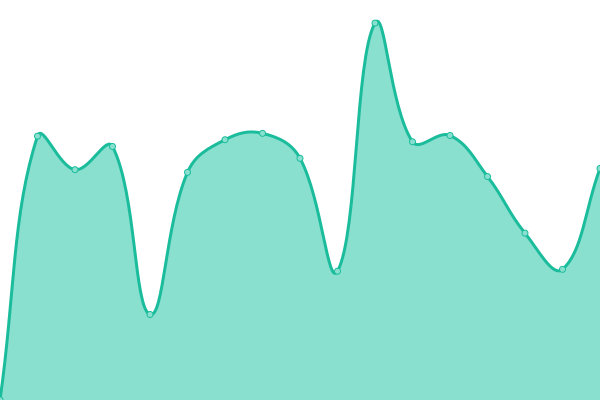
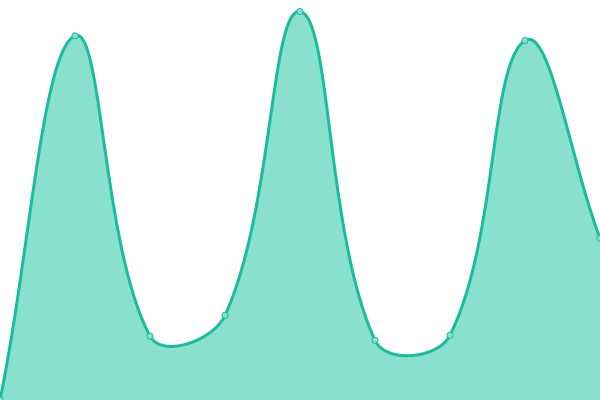

# [📈 Live Status](https://Clicki-Digital.github.io/uptime): <!--live status--> **🟧 Partial outage**

This repository contains the open-source uptime monitor and status page for [Clicki Digital](clickidigital.com.au), powered by [Upptime](https://github.com/upptime/upptime).

With [Upptime](https://upptime.js.org), you can get your own unlimited and free uptime monitor and status page, powered entirely by a GitHub repository. We use [Issues](https://github.com/Clicki-Digital/uptime/issues) as incident reports, [Actions](https://github.com/Clicki-Digital/uptime/actions) as uptime monitors, and [Pages](https://Clicki-Digital.github.io/uptime) for the status page.

<!--start: status pages-->
<!-- This summary is generated by Upptime (https://github.com/upptime/upptime) -->
<!-- Do not edit this manually, your changes will be overwritten -->
<!-- prettier-ignore -->
| URL | Status | History | Response Time | Uptime |
| --- | ------ | ------- | ------------- | ------ |
|  [Adam Brand Music](https://adambrandmusic.com) | 🟩 Up | [adam-brand-music.yml](https://github.com/Clicki-Digital/uptime/commits/HEAD/history/adam-brand-music.yml) | 

 1079ms
     
 | 

<a href="https://status.getlucid.solutions/history/adam-brand-music">100.00%</a>
    

|  [Aset App](https://asetapp.com) | 🟩 Up | [aset-app.yml](https://github.com/Clicki-Digital/uptime/commits/HEAD/history/aset-app.yml) | 

 2319ms
     
 | 

<a href="https://status.getlucid.solutions/history/aset-app">100.00%</a>
    

|  [Ausource International](https://ausourceintl.com.au) | 🟩 Up | [ausource-international.yml](https://github.com/Clicki-Digital/uptime/commits/HEAD/history/ausource-international.yml) | 

 1612ms
     
 | 

<a href="https://status.getlucid.solutions/history/ausource-international">100.00%</a>
    

|  [Australian Anti Ice Campaign](https://australianantiicecampaign.org.au) | 🟩 Up | [australian-anti-ice-campaign.yml](https://github.com/Clicki-Digital/uptime/commits/HEAD/history/australian-anti-ice-campaign.yml) | 

 1670ms
     
 | 

<a href="https://status.getlucid.solutions/history/australian-anti-ice-campaign">98.04%</a>
    

|  [Bookkeeper to the Smart People](https://bksp.com.au) | 🟩 Up | [bookkeeper-to-the-smart-people.yml](https://github.com/Clicki-Digital/uptime/commits/HEAD/history/bookkeeper-to-the-smart-people.yml) | 

 1304ms
     
 | 

<a href="https://status.getlucid.solutions/history/bookkeeper-to-the-smart-people">98.10%</a>
    

|  [Burdi](https://burdi.com.au) | 🟩 Up | [burdi.yml](https://github.com/Clicki-Digital/uptime/commits/HEAD/history/burdi.yml) | 

 671ms
     
 | 

<a href="https://status.getlucid.solutions/history/burdi">100.00%</a>
    

|  [Burdi - Selfservice](https://manage.burdi.com.au) | 🟩 Up | [burdi-selfservice.yml](https://github.com/Clicki-Digital/uptime/commits/HEAD/history/burdi-selfservice.yml) | 

 2101ms
     
 | 

<a href="https://status.getlucid.solutions/history/burdi-selfservice">100.00%</a>
    

|  [Cafe7](https://cafe7.com.au) | 🟩 Up | [cafe7.yml](https://github.com/Clicki-Digital/uptime/commits/HEAD/history/cafe7.yml) | 

 989ms
     
 | 

<a href="https://status.getlucid.solutions/history/cafe7">100.00%</a>
    

|  [CC Electrical and Air](https://ccelectricalandair.com.au) | 🟩 Up | [cc-electrical-and-air.yml](https://github.com/Clicki-Digital/uptime/commits/HEAD/history/cc-electrical-and-air.yml) | 

 1571ms
     
 | 

<a href="https://status.getlucid.solutions/history/cc-electrical-and-air">100.00%</a>
    

|  [Chariots of Light Australia](https://chariotsoflight.org.au) | 🟩 Up | [chariots-of-light-australia.yml](https://github.com/Clicki-Digital/uptime/commits/HEAD/history/chariots-of-light-australia.yml) | 

 3802ms
     
 | 

<a href="https://status.getlucid.solutions/history/chariots-of-light-australia">100.00%</a>
    

|  [ClaimsWrights](https://claimswrights.co.uk) | 🟩 Up | [claims-wrights.yml](https://github.com/Clicki-Digital/uptime/commits/HEAD/history/claims-wrights.yml) | 

 871ms
     
 | 

<a href="https://status.getlucid.solutions/history/claims-wrights">98.17%</a>
    

|  [Clicki Digital](https://clickidigital.com.au) | 🟩 Up | [clicki-digital.yml](https://github.com/Clicki-Digital/uptime/commits/HEAD/history/clicki-digital.yml) | 

 2416ms
     
 | 

<a href="https://status.getlucid.solutions/history/clicki-digital">64.17%</a>
    

|  [Col Stringer](https://colstringer.com) | 🟩 Up | [col-stringer.yml](https://github.com/Clicki-Digital/uptime/commits/HEAD/history/col-stringer.yml) | 

 1122ms
     
 | 

<a href="https://status.getlucid.solutions/history/col-stringer">98.29%</a>
    

|  [Diverse AirCon & Mechanical](https://diverseaircon.com.au) | 🟩 Up | [diverse-air-con-and-mechanical.yml](https://github.com/Clicki-Digital/uptime/commits/HEAD/history/diverse-air-con-and-mechanical.yml) | 

 3651ms
     
 | 

<a href="https://status.getlucid.solutions/history/diverse-air-con-and-mechanical">98.34%</a>
    

|  [EntVenture](https://entventure.org) | 🟩 Up | [ent-venture.yml](https://github.com/Clicki-Digital/uptime/commits/HEAD/history/ent-venture.yml) | 

 2788ms
     
 | 

<a href="https://status.getlucid.solutions/history/ent-venture">98.40%</a>
    

|  [Eyrth](https://eyrth.com) | 🟩 Up | [eyrth.yml](https://github.com/Clicki-Digital/uptime/commits/HEAD/history/eyrth.yml) | 

 3242ms
     
 | 

<a href="https://status.getlucid.solutions/history/eyrth">98.45%</a>
    

|  [Flameright](https://flameright.com.au) | 🟩 Up | [flameright.yml](https://github.com/Clicki-Digital/uptime/commits/HEAD/history/flameright.yml) | 

 749ms
     
 | 

<a href="https://status.getlucid.solutions/history/flameright">100.00%</a>
    

|  [Gracious5](https://gracious5.com) | 🟩 Up | [gracious5.yml](https://github.com/Clicki-Digital/uptime/commits/HEAD/history/gracious5.yml) | 

 817ms
     
 | 

<a href="https://status.getlucid.solutions/history/gracious5">100.00%</a>
    

|  [Heritage of Faith Christian Church - Gold Coast](https://heritageoffaith.com.au) | 🟩 Up | [heritage-of-faith-christian-church-gold-coast.yml](https://github.com/Clicki-Digital/uptime/commits/HEAD/history/heritage-of-faith-christian-church-gold-coast.yml) | 

 3429ms
     
 | 

<a href="https://status.getlucid.solutions/history/heritage-of-faith-christian-church-gold-coast">100.00%</a>
    

|  [Ian Slack](https://ianslack.com.au) | 🟩 Up | [ian-slack.yml](https://github.com/Clicki-Digital/uptime/commits/HEAD/history/ian-slack.yml) | 

 1414ms
     
 | 

<a href="https://status.getlucid.solutions/history/ian-slack">98.51%</a>
    

|  [Independent Wealth Management Australia](https://iwmaus.com.au) | 🟩 Up | [independent-wealth-management-australia.yml](https://github.com/Clicki-Digital/uptime/commits/HEAD/history/independent-wealth-management-australia.yml) | 

 2026ms
     
 | 

<a href="https://status.getlucid.solutions/history/independent-wealth-management-australia">98.57%</a>
    

|  [Jerry Savelle Ministries International Australia](https://jsmiaustralia.org) | 🟩 Up | [jerry-savelle-ministries-international-australia.yml](https://github.com/Clicki-Digital/uptime/commits/HEAD/history/jerry-savelle-ministries-international-australia.yml) | 

 2454ms
     
 | 

<a href="https://status.getlucid.solutions/history/jerry-savelle-ministries-international-australia">100.00%</a>
    

|  [K-Thorne](https://k-thorne.com) | 🟩 Up | [k-thorne.yml](https://github.com/Clicki-Digital/uptime/commits/HEAD/history/k-thorne.yml) | 

 2181ms
     
 | 

<a href="https://status.getlucid.solutions/history/k-thorne">98.60%</a>
    

|  [Lance N. Solomon](https://lancensolomon.com.au) | 🟩 Up | [lance-n-solomon.yml](https://github.com/Clicki-Digital/uptime/commits/HEAD/history/lance-n-solomon.yml) | 

 913ms
     
 | 

<a href="https://status.getlucid.solutions/history/lance-n-solomon">98.66%</a>
    

|  [Lil Fi](https://lilfi.com) | 🟩 Up | [lil-fi.yml](https://github.com/Clicki-Digital/uptime/commits/HEAD/history/lil-fi.yml) | 

 2021ms
     
 | 

<a href="https://status.getlucid.solutions/history/lil-fi">100.00%</a>
    

|  [Living Word Church](https://livingword.org.au) | 🟩 Up | [living-word-church.yml](https://github.com/Clicki-Digital/uptime/commits/HEAD/history/living-word-church.yml) | 

 993ms
     
 | 

<a href="https://status.getlucid.solutions/history/living-word-church">100.00%</a>
    

|  [The Local Paradise Point (The Local PP)](https://thelocalpp.com.au) | 🟩 Up | [the-local-paradise-point-the-local-pp.yml](https://github.com/Clicki-Digital/uptime/commits/HEAD/history/the-local-paradise-point-the-local-pp.yml) | 

 913ms
     
 | 

<a href="https://status.getlucid.solutions/history/the-local-paradise-point-the-local-pp">100.00%</a>
    

|  [LT Consulting](https://ltconsulting.com.au) | 🟩 Up | [lt-consulting.yml](https://github.com/Clicki-Digital/uptime/commits/HEAD/history/lt-consulting.yml) | 

 1012ms
     
 | 

<a href="https://status.getlucid.solutions/history/lt-consulting">100.00%</a>
    

|  [Lucid Solutions](https://getlucid.solutions) | 🟩 Up | [lucid-solutions.yml](https://github.com/Clicki-Digital/uptime/commits/HEAD/history/lucid-solutions.yml) | 

 1022ms
     
 | 

<a href="https://status.getlucid.solutions/history/lucid-solutions">100.00%</a>
    

|  [Minds and Hearts](https://mindsandhearts.net) | 🟩 Up | [minds-and-hearts.yml](https://github.com/Clicki-Digital/uptime/commits/HEAD/history/minds-and-hearts.yml) | 

 1230ms
     
 | 

<a href="https://status.getlucid.solutions/history/minds-and-hearts">98.72%</a>
    

|  [Moncai](https://moncai.com.au) | 🟩 Up | [moncai.yml](https://github.com/Clicki-Digital/uptime/commits/HEAD/history/moncai.yml) | 

 3236ms
     
 | 

<a href="https://status.getlucid.solutions/history/moncai">98.76%</a>
    

|  [NicNax](https://nicnax.com.au) | 🟩 Up | [nic-nax.yml](https://github.com/Clicki-Digital/uptime/commits/HEAD/history/nic-nax.yml) | 

 2344ms
     
 | 

<a href="https://status.getlucid.solutions/history/nic-nax">100.00%</a>
    

|  [Nomolos](https://nomolos.com.au) | 🟩 Up | [nomolos.yml](https://github.com/Clicki-Digital/uptime/commits/HEAD/history/nomolos.yml) | 

 710ms
     
 | 

<a href="https://status.getlucid.solutions/history/nomolos">98.82%</a>
    

|  [OhDee](https://ohdee.com.au) | 🟩 Up | [oh-dee.yml](https://github.com/Clicki-Digital/uptime/commits/HEAD/history/oh-dee.yml) | 

 1034ms
     
 | 

<a href="https://status.getlucid.solutions/history/oh-dee">98.88%</a>
    

|  [ODIGDesigns](https://www.odigdesigns.com.au) | 🟩 Up | [odig-designs.yml](https://github.com/Clicki-Digital/uptime/commits/HEAD/history/odig-designs.yml) | 

 1272ms
     
 | 

<a href="https://status.getlucid.solutions/history/odig-designs">98.94%</a>
    

|  [Omega Communication Services](https://omegacoms.com.au) | 🟩 Up | [omega-communication-services.yml](https://github.com/Clicki-Digital/uptime/commits/HEAD/history/omega-communication-services.yml) | 

 801ms
     
 | 

<a href="https://status.getlucid.solutions/history/omega-communication-services">99.01%</a>
    

|  [RAC Equipment](https://racequipment.com.au) | 🟩 Up | [rac-equipment.yml](https://github.com/Clicki-Digital/uptime/commits/HEAD/history/rac-equipment.yml) | 

 696ms
     
 | 

<a href="https://status.getlucid.solutions/history/rac-equipment">99.07%</a>
    

|  [Solomon Ninja](https://solomon.ninja) | 🟩 Up | [solomon-ninja.yml](https://github.com/Clicki-Digital/uptime/commits/HEAD/history/solomon-ninja.yml) | 

 2080ms
     
 | 

<a href="https://status.getlucid.solutions/history/solomon-ninja">99.13%</a>
    

|  [Swell Plumbing and Gas](https://swellplumbingandgas.com.au) | 🟩 Up | [swell-plumbing-and-gas.yml](https://github.com/Clicki-Digital/uptime/commits/HEAD/history/swell-plumbing-and-gas.yml) | 

 997ms
     
 | 

<a href="https://status.getlucid.solutions/history/swell-plumbing-and-gas">100.00%</a>
    

|  [TEDx CYW](https://tedxycyw.com) | 🟥 Down | [te-dx-cyw.yml](https://github.com/Clicki-Digital/uptime/commits/HEAD/history/te-dx-cyw.yml) | 

 2119ms
     
 | 

<a href="https://status.getlucid.solutions/history/te-dx-cyw">7.33%</a>
    

|  [Worship Ministries International](https://worshipministriesinternational.com) | 🟩 Up | [worship-ministries-international.yml](https://github.com/Clicki-Digital/uptime/commits/HEAD/history/worship-ministries-international.yml) | 

 909ms
     
 | 

<a href="https://status.getlucid.solutions/history/worship-ministries-international">99.24%</a>
    

|  [Young Discoverers](https://youngdiscoverers.org.au) | 🟩 Up | [young-discoverers.yml](https://github.com/Clicki-Digital/uptime/commits/HEAD/history/young-discoverers.yml) | 

 5498ms
     
 | 

<a href="https://status.getlucid.solutions/history/young-discoverers">100.00%</a>
    

<!--end: status pages-->

[**Visit our status website →**](https://Clicki-Digital.github.io/uptime)

## 📄 License

- Powered by: [Upptime](https://github.com/upptime/upptime)
- Code: [MIT](./LICENSE) © [Clicki Digital](clickidigital.com.au)
- Data in the `./history` directory: [Open Database License](https://opendatacommons.org/licenses/odbl/1-0/)
